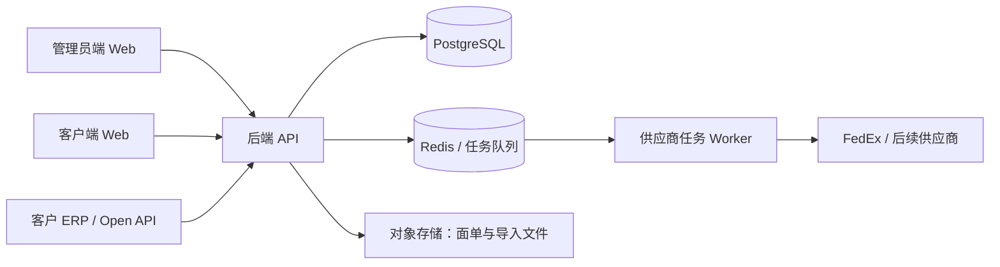
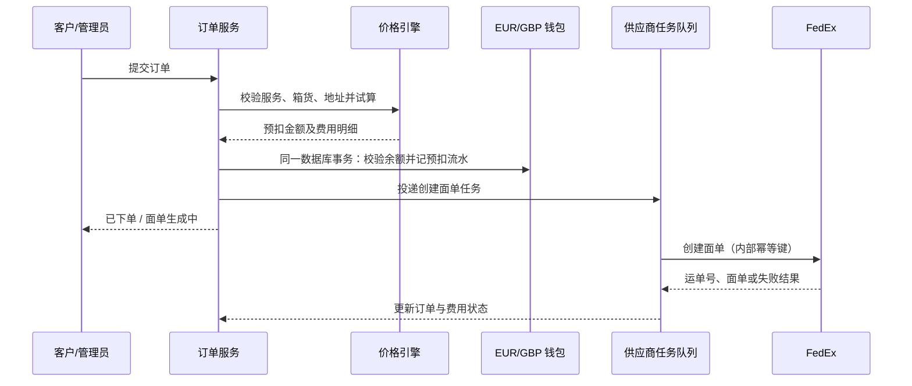

# 总体系统设计与开发方案

> **阅读提示（2026-08-06）**：本文件保留总体架构、设计依据与原始里程碑。其“当前阶段”“首个 FedEx 方式”和“未完成能力”等状态性描述可能早于实际代码；继续开发前请先阅读 [当前开发基线](./00-current-development-status.md)。当前首个 FedEx 对接已确定为 Ship-API Direct 中转站，详见 [FedEx 中转站接入说明](./12-fedex-relay-integration.md)。

> 文档状态：开发建议方案（已汇总当前确认需求）  
> 首个对接：FedEx 官方 REST API 测试环境  
> 版本：v0.1 / 2026-08-05

## 1. 建设目标与一期边界

本系统是面向中国发往欧洲的尾程物流打单、客户计费与账单管理平台。它不是单纯的面单生成工具：从客户余额、创建提单、供应商调用、取消退款、供应商实重返回到会计差额对账，必须形成可追溯的完整闭环。

一期目标是交付一个可用的 **FedEx 测试闭环**，并把供应商适配层、价格引擎和资金账本设计为可扩展结构，以便后续接入 UPS、DHL、代理商和中转站。

一期包含：

- 两个独立网站：管理员端、客户自助端；
- 客户、EUR/GBP 双币种余额、人工入账／扣减和资金流水；
- 供应商、渠道、服务、欧洲国家组、偏远地址模板；
- 供应商成本表、服务利润表、版本与生效时间；
- 人工创建、Excel 导入、开放 API 创建订单；
- 订单预扣、FedEx 创建／取消面单、面单文件管理；
- 会计实际对账、补扣／退款；
- 基础账单与运营统计；
- FedEx Sandbox 的联调、异常与幂等测试。

一期暂不纳入：在线支付、自动换汇、供应商智能路由／自动故障切换、独立轨迹管理菜单、高级客户风控。轨迹可先作为订单详情中的物流信息；风控在积累实际与预估重量数据后建设。

## 2. 总体架构

建议采用 **模块化单体**。首期不拆微服务，以避免资金、订单、报价跨服务事务带来的复杂度；但在代码、数据库和消息任务层面清晰隔离领域模块，后续可以独立拆分供应商接入或报表服务。



后端对外接口按访问对象分离：

```text
/api/admin/v1/*      管理员端
/api/customer/v1/*   客户端
/api/open/v1/*       客户 ERP 的 API Key 接口
```

权限和数据范围必须由后端校验。客户不能通过修改请求中的服务、客户编号或渠道编号，访问其他客户数据、供应商成本、供应商账号或平台利润。

## 3. 供应商、渠道与服务

业务关系如下：

```text
供应商（FedEx、UPS、代理商……）
  └─ 渠道（账号 + 环境 + 接口驱动 + 运行配置）
       └─ 服务（客户可选的物流产品）
```

- 一个供应商可建立多个渠道，例如不同账号、测试／生产环境或接口版本；
- 一个渠道可提供多个服务；
- 一个服务只绑定一个渠道；订单只能选择服务，后端据此找到固定渠道；
- 新协议开发新的 Connector Driver；仅账号、环境或域名不同则复用已有驱动并新增渠道配置。

统一适配器接口建议如下：

```ts
interface CarrierConnector {
  validateOrder(input): ValidationResult;
  quote?(input): CarrierQuote;       // 可选，仅作供应商成本校验
  createShipment(input): CreateResult;
  cancelShipment(input): CancelResult;
  queryShipment(input): QueryResult;
  track?(input): TrackingResult;
}
```

每次调用都必须保存内部请求号、供应商请求号、脱敏请求／响应、耗时、重试次数和最终结果。创建面单使用内部幂等键，网络超时或未知结果时先查单，不可盲目重试或直接退款。

## 4. 功能划分与页面结构

管理员端使用左侧可折叠菜单、顶部系统栏加标签栏、中央内容工作区。点击功能打开标签，不进行整页跳转；刷新恢复标签与当前页，退出并重新登录后仅打开首页。

| 一级菜单 | 建议二级页／核心能力 |
|---|---|
| 订单管理 | 订单列表、创建运单、Excel 导入、订单详情、订单标识规则 |
| 客户管理 | 客户、余额预警设置；详情内含基础信息、余额、API 密钥、资金记录 |
| 产品与渠道 | 供应商、渠道、服务、国家组 |
| 报价管理 | 供应商成本表、服务利润表、偏远地址模板、附加费规则 |
| 账单管理 | 客户资金流水、订单应收对账、供应商应付核对、退款／补扣记录 |
| 数据统计 | 订单量、客户余额、应收应付、对账待办、服务／国家维度汇总 |

客户端首期提供：登录／注册、创建订单、订单列表与详情、面单下载、余额、资金流水、账单。客户冻结后可登录，但仅可查看余额、账单与充值信息，不能下单或调用开放 API。

推荐管理员角色：超级管理员、运营、财务、报价管理员、客服。特别是余额调整、实际对账、供应商密钥管理必须最小权限授权并留审计日志。

## 5. 核心业务流程

### 5.1 下单与预扣



下单校验包括：服务启用状态、目的国家、清关方式、交货条款、一票多件限制、最小件数、最大票实重、地址格式、申报明细与余额。下单与 `SHIPPING_PRECHARGE` 资金流水必须处于同一数据库事务，按客户订单幂等键去重。

物流状态和费用状态独立：

| 维度 | 关键状态 |
|---|---|
| 物流 | 已下单、已生成、已收货、退件、已取消；内部另有创建中、创建失败、调用结果未知 |
| 费用 | 已预扣、最终收费重待确认、待实际对账、已对账、退款完成、补扣完成 |

一票订单可有多个箱号，但只对应一个承运商运单号／面单。每箱有重量、长宽高及多条申报货品；每条申报货品有中英文品名、材质、数量、单件货值与币种，系统计算箱与订单总货值。

### 5.2 报价、预扣与最终对账

基础运费计算顺序：

```text
供应商基础运费成本
  + 服务利润（成本百分比或固定加价）
  = 基础客户运费
  + 已触发且逐项保留两位小数的燃油费、偏远费、超重费
  = 客户最终报价／应收
```

- 成本表绑定供应商；利润表绑定服务；二者都支持版本、生效时间和历史快照；
- 利润匹配优先级：指定客户 > 客户分组 > 客户等级 > 默认报价；
- 全系统重量单位为 kg、尺寸单位为 cm；
- 体积计费：`长 × 宽 × 高 ÷ 1,000,000` 得 m³，再按每 m³ 价格计费；
- 按“实重与材积重取大值”时，预扣使用客户预估收费重与系统材积重的较大值；
- 重量价表支持可配置固定区间价、超过阈值后的全票每公斤价和按箱最低收费；区间与阈值绝不写死；
- 燃油、偏远、超重各自完成计算后均按服务币种四舍五入至两位小数；再汇总总额；
- 每服务最多绑定一个偏远地址模板；勾选偏远收费后在服务中选择模板并设置偏远费。偏远模板在报价管理维护。偏远费只形成客户应收，不单列供应商成本；
- 超重费用表达式在预扣阶段按预估重量计算、在最终阶段按供应商实重计算；表达式使用受控 AST 规则引擎，不能执行 SQL、JavaScript 或任意脚本。

供应商实重／最终收费重到达后，不覆盖预扣数据。系统计算最终应收差额，生成会计待办；会计确认后才执行补扣或退款。若补扣使某币种余额为负，该客户只被禁止使用同币种服务下单，另一币种不受影响。

### 5.3 取消和退款

客户或管理员发起取消后，后端先验证未收货／拣货且渠道允许取消，再调用供应商取消。只有供应商确认取消成功、或确认该订单从未创建成功时，才创建原币种 `CANCELLATION_REFUND` 流水。供应商调用未知时必须查单；不能因为超时而直接退款。

## 6. 数据模型（首期）

| 领域 | 主要表／实体 |
|---|---|
| 身份与权限 | users、roles、permissions、admin_user_roles、customer_accounts、api_keys、audit_logs |
| 客户与资金 | customers、customer_wallets、wallet_ledger、balance_alert_settings、notifications |
| 产品与渠道 | suppliers、connector_drivers、supplier_channels、services、country_groups、country_group_members、remote_area_templates、remote_postcode_rules、service_remote_fee_configs |
| 价格 | supplier_cost_versions、supplier_cost_rows、service_profit_versions、service_profit_rows、surcharge_rules |
| 订单 | orders、order_boxes、order_item_declarations、shipment_labels、order_markers、order_fee_lines、order_price_snapshots |
| 供应商调用 | supplier_requests、supplier_response_events、connector_jobs、tracking_events |
| 财务对账 | reconciliation_cases、reconciliation_adjustments、supplier_payable_records |
| 文件 | file_objects、import_jobs、import_error_rows |

关键约束：

- 金额使用数据库 `numeric`，不使用浮点数；金额字段按 EUR/GBP 保留两位小数，重量与尺寸保留更高精度；
- `wallet_ledger` 只新增不可修改，修正通过反向流水；
- 客户钱包扣款用行级锁或等效并发控制，避免并发下单导致超扣；
- 订单、价格版本、费用项、供应商调用结果全部保留快照与关联号；
- 供应商密钥加密存储；客户 API Key 仅存哈希，原文仅创建／轮换时一次性展示给管理员。

## 7. 推荐技术选型

| 层级 | 推荐 | 原因 |
|---|---|---|
| 代码仓库 | pnpm Monorepo + Turborepo | 管理两个前端、后端、共享类型与 UI 包，发布仍可独立 |
| 管理员端／客户端 | React + TypeScript + Vite + Ant Design | 适合复杂后台表格、表单和标签页；构建两个独立网站 |
| 后端 | Node.js LTS + TypeScript + NestJS | 模块化、依赖注入、队列、鉴权和 OpenAPI 支持成熟，适合插件化供应商驱动 |
| 数据库 | PostgreSQL 16 | 事务、精确数值、约束、JSONB 和审计查询能力适合订单与资金账本 |
| 数据访问 | Prisma + SQL Migration | 类型安全；关键钱包事务可使用显式 SQL／事务锁实现 |
| 缓存与异步任务 | Redis + BullMQ | Token 缓存、外部接口任务、重试、导入与通知任务 |
| 文件存储 | S3 兼容对象存储（开发 MinIO，生产云对象存储） | 保存 PDF/PNG/ZPL 面单和 Excel 导入文件，以签名短链接下载 |
| API | REST + OpenAPI 3.0 | 管理端、客户端和 ERP 易于接入；自动生成接口文档 |
| 部署 | Docker Compose 起步；Nginx / 云负载均衡；CI/CD | 先保障可重复部署，后续可平滑容器编排 |
| 监控 | 结构化日志、Sentry、指标与健康检查 | 外部接口失败、未知状态与资金操作可追踪告警 |

项目建议目录：

```text
apps/
  admin-web/          管理员网站
  customer-web/       客户网站
  api/                NestJS 后端与 Worker
packages/
  shared-types/       DTO、枚举、金额与状态定义
  pricing-engine/     纯函数报价与规则解释器
  connector-sdk/      供应商适配器抽象
  ui/                 两端可复用基础组件
infra/                Docker、数据库、部署配置
docs/system-design/   本设计文档
```

## 8. FedEx 首个测试接入

FedEx 首期在正式“供应商与渠道”中建立 `FedEx` 尾程渠道及 Sandbox 供应商连接，并在正式“服务管理”中绑定相应服务。Sandbox 是供应商连接环境，不是独立业务类型；后续增加 Production 连接和配置时沿用相同的信息架构。后端缓存短期访问令牌，密钥绝不进入浏览器或代码仓库。

FedEx 官方开发者资料说明：测试与生产环境 URL 不同；OAuth token 有效期为一小时；测试凭据、账号和 API 项目需在 Developer Portal 建立。实施前由业务方提供或共同创建 Sandbox 项目、测试账号、API Key／Secret、允许的服务和目的国。[FedEx Shipper Getting Started](https://developer.fedex.com/api/en-vc/get-started/shipper.html) 与 [FedEx integration best practices](https://developer.fedex.com/api/en-gb/guides/best-practices.html)。

FedEx Connector 的验收顺序：

1. OAuth 令牌获取、缓存和失效刷新；
2. 使用固定测试地址创建单箱面单，保存运单号和 PDF／PNG／ZPL 文件；
3. 测试重复提交、业务失败、网络超时、结果未知后的查单；
4. 测试生成后取消与退款前置校验；
5. 测试追踪数据映射到订单物流信息；
6. 用模拟供应商实重／最终收费重事件测试会计对账、补扣和退款。

需要注意：创建面单接口不应被假设为最终实际计费数据来源。最终供应商成本／收费重统一通过“供应商回传、账单导入或会计录入”进入对账模块；FedEx Sandbox 首期先验证接口闭环，并以模拟或导入数据覆盖最终对账测试。

**最终数据来源规则已确定**：优先使用供应商接口回传或查单返回的最终实重、最终收费重和实际成本；若供应商不提供可靠回传，则上传供应商账单 Excel 进行导入识别。账单导入需保存文件、供应商、渠道、账单周期、导入批次和原始行；按运单号为主键，结合渠道／账号、币种等信息匹配订单。未匹配、重复或冲突行进入人工处理，匹配结果进入会计对账待办，绝不直接改动客户余额。

## 9. 实施里程碑与交付物

| 阶段 | 主要内容 | 可验收结果 |
|---|---|---|
| M0：工程与规范 | Monorepo、Docker、本地环境、数据库迁移、权限骨架、审计与日志、CI | 一键启动；两端可登录；API 文档与基础监控可用 |
| M1：客户与资金 | 客户开户／审核、冻结、双币种钱包、人工入账／扣减、预警、API Key | 财务可追溯地调整余额；冻结和欠费限制正确生效 |
| M2：主数据与计价 | 尾程渠道／供应商连接／服务、欧洲国家组、偏远模板、成本／利润版本、报价引擎 | 同一订单在版本快照下可稳定试算并输出费用明细 |
| M3：订单与 FedEx | 手工下单、Excel 导入、开放 API、预扣、FedEx 创建／取消、面单管理 | Sandbox 能完成从下单、预扣到生成／取消的闭环 |
| M4：账单与对账 | 接口实际数据接收、供应商账单 Excel 导入与匹配、应收／应付、会计确认、补扣／退款、客户账单 | 差额调整生成正确的不可变资金流水和审计记录 |
| M5：体验与统计 | 双端页面完善、多标签恢复、搜索导出、基础仪表盘、站内通知 | 运营、财务、客户可在各自端完成日常操作 |
| M6：上线准备 | 全量测试、权限审计、备份恢复演练、生产 FedEx 凭据与验收 | 生产环境可部署、可监控、可恢复，并通过业务验收用例 |

每一阶段结束前都补充：数据库迁移、接口文档、单元测试、关键流程集成测试、变更记录和可回滚部署包。不会跳过资金、取消退款、供应商未知结果这些高风险场景。

## 10. 质量、安全与审计要求

- 所有金额计算使用十进制；价格引擎建立单元测试，覆盖边界重量、按票／按箱、最低收费、偏远地址与三类附加费舍入；
- 供应商接口在测试环境使用 Mock Connector 与 FedEx Sandbox 双层测试，避免 Sandbox 固定样例限制掩盖自身逻辑问题；
- API Key、供应商 Secret、面单下载链接按最小权限、加密和过期策略处理；日志不写入完整密钥、Authorization、身份证明或完整收件人敏感信息；
- 对余额调整、订单创建／取消、报价发布、会计确认、密钥轮换记录操作人、时间、前后状态与关联单号；
- 每日数据库备份与定期恢复演练；面单文件存储设置生命周期与访问审计；
- 对公开 API 使用签名／API Key、限流、IP 白名单（如客户需要）与请求幂等键。

## 11. 开工前仍需补齐的业务决定

以下不阻塞 M0 的工程初始化，但会影响对应功能上线前的最终实现：

1. 利润表币种与供应商成本币种是否允许不同；若允许，汇率来源、锁定时点和汇兑损益如何处理；
2. 首期价格表除“固定区间 + 超阈值每公斤 + 最低收费 + 体积”外，是否还要支持首重续重、累进阶梯；建议首期暂不支持，确认真实价卡后再扩展；
3. 首个 FedEx 账单 Excel 的列结构、账单周期和运单号格式，以便配置首版导入映射；
4. 服务停用后，已有草稿、待下单和导入中订单的处理规则；
5. 多件服务是否需要最大件数；
6. 哪些管理员角色可调整余额、发布报价、确认对账，是否要双人复核；
7. 自助注册客户在待审核、待核对充值阶段是否允许登录查看进度。

## 12. 建议的下一步

先确认第 11 节中与报价、资金和 FedEx 数据来源有关的问题；同时可以立即启动 M0：初始化仓库、后端模块边界、双前端骨架、数据库迁移框架与本地 Docker 环境。取得 FedEx Sandbox 凭据后，M3 再接入真实测试 API。
